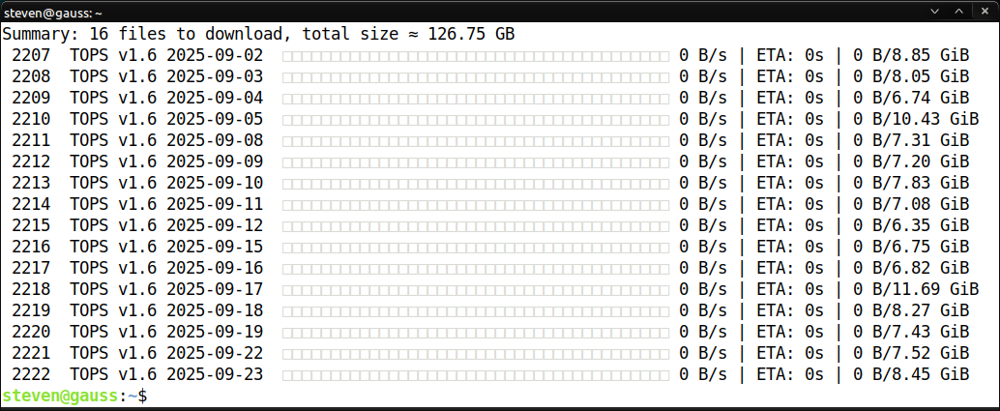

[](https://github.com/vargaconsulting/iex-download/actions/workflows/ci.yml)
[](LICENSE)
[](https://doi.org/10.5281/zenodo.17188420)
[](https://github.com/vargaconsulting/iex-download/releases)
[](https://vargaconsulting.github.io/iex-download)

# IEX High Frequency Dataset

The Investors Exchange (IEX) provides free access to historical datasets such as **Top of Book (TOPS)** and **Depth of Book (DEEP)** through its web interface. Unfortunately, downloading these files manually requires clicking through each link — impractical for large-scale research or backtesting. This project provides `iex-download`, a **Rust-based automation tool** for fetching these datasets programmatically.

### Why Bother?

Because with this tool you can fetch over **13 TB of IEX tick data** (≈13,281 GB across 4,600 files as of 2025-09-30) in a single run as long as you agree to the [IEX Historical Data Terms of Use][101]. In a recent [blog post][201] I mentioned only ~6 TB — but that was just the TOPS feed. The full picture includes the depth feeds (**DEEP** and the recently released **DEEP+**), which are far larger. Think of trading data like an iceberg: **TOPS** is the shiny tip (best bid/ask + last trade), while **DEEP/DEEP+** contain the mass below the surface — depth, weight, and real research value. That’s where this tool helps you dive in.

<table><tr><td>
Here’s the lay of the land as of 2025 Sept 23:

| Feed   | Files to Download | Total Size (≈ GB) |
|--------|------------------:|------------------:|
| **TOPS**  | 2,285 | 5,947.68 |
| **DEEP**  | 2,115 | 5,955.02 |
| **DEEP+** |   197 | 1,353.52 |
| **TOTAL** | 4,597 | 13,256.22 |


</td><td>

<picture>
  <source media="(prefers-color-scheme: dark)" srcset="docs/assets/screenshot-dark.png" width="500">
  <source media="(prefers-color-scheme: light)" srcset="docs/assets/screenshot-light.png" width="500">
  
</picture>

</td></tr></table>

### Key Differences (TOPS vs DEEP vs DEEP+)

| Feature                                     | TOPS (Top-of-book)                                                | DEEP (Aggregated)                                                                 | DEEP+ (Order-by-order)                                                                                |
| ------------------------------------------- | ----------------------------------------------------------------- | --------------------------------------------------------------------------------- | ----------------------------------------------------------------------------------------------------- |
| **Order granularity**                       | Only best bid/ask + last trade                                    | Aggregated by price level (size summed)                                           | Individual orders (each displayed order)                                                              |
| **OrderID / update per order**              | Not present                                                       | Not present                                                                       | Present                                                                                               |
| **Hidden / non-display / reserve portions** | Not shown                                                         | Not shown                                                                         | Not shown                                                                                             |
| **Memory / bandwidth load**                 | Lowest (very compact, minimal updates)                            | Lower (fewer messages, coarser updates)                                           | Higher (tracking many individual orders, cancels, modifications)                                      |
| **Use-cases**                               | Quote feeds, NBBO tracking, top-level liquidity, lightweight apps | General depth, price level elasticity, coarse modelling, liquidity at price tiers | Detailed book shape, order flow-level strategy, detailed execution modelling, microstructure research |


## Features at a Glance

- **Progress bar with attitude** → because watching terabytes flow should feel satisfying.  
- **PEG-based date parser** → type `2025-01-??` or `2025-01-02,2025-01-03,2025-01-06,2025-01-2?` and it just works, no regex headaches.  
- **One tiny ELF** → a single 3.5 MB executable (`-rwxrwxr-x 2 steven steven 3.5M Sep 23 11:00 target/release/iex-download`).  
  No Python venvs, no dependency jungles. Drop it anywhere, `chmod +x`, and let it rip.  
- Need details? Just ask my imaginary friend, Manual. He’s got you covered. `man iex-download` of `iex-download --help`


## Next Steps: [From PCAP to HDF5][202]

Downloading is just the first half of the journey. To make the IEX datasets usable for analysis and backtesting, pair this tool with [iex2h5][202].  

- `iex-download` → grabs raw gzipped PCAP files from IEX  
- [`iex2h5`][202] → converts PCAP streams into efficient HDF5 datasets (RTS/IRTS, statistics, matrices)  

Example workflow:

```bash
# Download a batch of gzip-compressed PCAP files
iex-download --tops --directory ./data 2016-12-01..2016-12-31  

# Convert the IRTS stream into an HDF5 container
iex2h5 -c irts -o iex-archive.h5 ./data/*.pcap.gz

# Convert IRTS streams into daily price matrices sampled every 10 seconds for the month of September 2025
iex2h5 -c rts --time-interval 00:00:10 --date-range 2025-09-01:2025-09-30 -o experiment-001.h5 iex-archive.h5
````

**Tip:** Don’t try to pull the entire dataset in one go (we’re talking 13+ TB and counting). Instead, download in manageable batches and incrementally add the IrRegular Time Series (IRTS) stream into your HDF5 container. Once caught up to the current trading day, you only need to maintain it with daily updates. That way the commands are tight, the warning about data size is still there, but placed below as advice.  

## Prerequisites

- A recent Rust toolchain (e.g. via [rustup](https://rustup.rs/))  

Clone the repository:

```bash
git clone git@github.com:vargaconsulting/iex-download.git
cd iex-download
````

Build and run:

```bash
make && make install
```

### Notice:
“[Data provided][100] for free by IEX. By accessing or using IEX Historical Data, you agree to the [IEX Historical Data Terms of Use][101].”


[100]: https://iextrading.com/trading/market-data/
[101]: https://www.iexexchange.io/legal/hist-data-terms
[201]: https://steven-varga.ca/blog/longest-active-stocks-from-iex-pcap/
[202]: https://steven-varga.ca/site/iex2h5/
[203]: https://steven-varga.ca/iex2h5/
